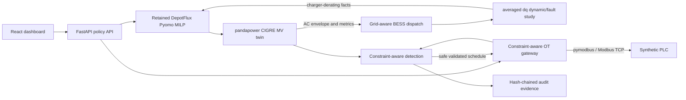
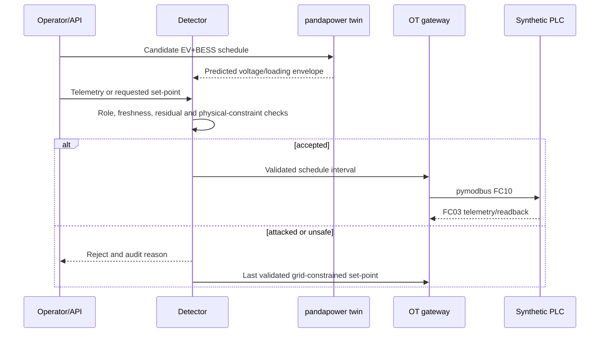

# GridTwin Ops architecture

Status: implemented five-to-seven-day evidence sprint. All equipment, telemetry,
attacks and recovery actions are synthetic and software-only.

## System context

GridTwin Ops extends the retained DepotFlux product line. The existing Pyomo
electric-fleet MILP still produces the EV schedule; the extension adds a 500
kWh/250 kW BESS dispatch layer and evaluates the aggregate schedule against the
open CIGRE MV benchmark using balanced AC power flow in pandapower. The existing
approval, API, dashboard, segmented Compose networks, audit evidence, gateway
and synthetic PLC remain in place.

The source diagram is
[`diagrams/gridtwin-architecture.mmd`](diagrams/gridtwin-architecture.mmd).

## Implemented interfaces

| Producer | Consumer | Contract | Trust decision |
|---|---|---|---|
| DepotFlux input registry | EV optimizer | immutable JSON + SHA-256 | reject unknown or changed fixture |
| EV optimizer | grid dispatch | 48 import/export energy intervals | validate finite, complete schedule |
| Grid dispatch | pandapower | depot kW, BESS kW, 0.5 h interval | reject infeasible envelope |
| pandapower | detector/API | voltage, line/transformer loading, losses | compare with explicit limits |
| Grid schedule | averaged dq dynamics | peak-interval EV/BESS P/Q trajectory | validate load, sag, fault and inverter-trip response |
| Dynamic screen | remaining-horizon optimizer | existing charger-derating structured facts | request reschedule without direct dispatch |
| API | OT gateway | approved schedule interval and UUID | role, approval, hash, freshness, replay, range |
| OT gateway | PLC simulator | FC10 write and FC03 read via `pymodbus` | allowlisted conduit and bounded retry |
| Detector | recovery policy | trusted physics state and validated schedule | no untrusted measurement in recovery input |
| All security cases | evidence artifact | canonical JSON + previous hash | verify chain before reporting |

## Feeder and resource assumptions

- pandapower 3.5.4 `create_cigre_network_mv(with_der=False)`.
- Original CIGRE load values are retained and scaled uniformly to 0.55 to form a
  documented synthetic operating snapshot.
- The EV import/V2G resource and BESS connect to named `Bus 11`.
- EV import operates at 0.98 power factor. The educational BESS inverter follows
  the same power factor; no voltage-control or reactive-power optimization is
  claimed.
- The AC-derived conservative import envelope is 1,371.545 kW for this snapshot.
- Limits are 0.95–1.05 pu, 100% line loading and 100% transformer loading.
- The separate dynamic layer uses an 11 kV/2 MVA balanced Thevenin equivalent,
  declared R-L-C and current-control parameters, a 25 microsecond RK4 step and a
  6.25 microsecond fine-step reference. It is averaged-value, not switching EMT.

## Control and recovery sequence

## Deployment boundary

Compose provides enterprise, industrial-DMZ, supervisory, control and monitoring
networks. These are educational zones and conduits, not industrial firewalls.
`direct_asset_control=false` remains mandatory. No adapter in this repository is
authorized to address a physical PLC, charger, bus, BESS, utility interface or
field network.
