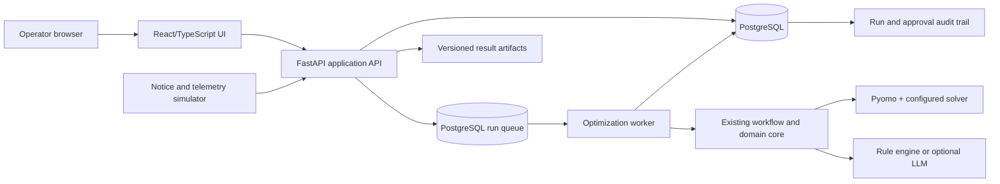

# Industry Demonstrator Work Package

## Agentic Aggregator: Electric-Fleet Decision Support

| Field | Definition |
|---|---|
| Work package | WP-ID-01: Industry Demonstrator |
| Duration | 8 calendar weeks |
| Planned capacity | 90 person-days (approximately 2.25 FTE) |
| Target environment | One synthetic electric-bus depot |
| Target users | Fleet dispatcher, depot energy manager, demonstration administrator |
| Product level | Pilot-facing decision-support demonstrator |
| Operating boundary | Human approval required; no direct control of physical chargers or vehicles |
| Primary outcome | A deployable application that demonstrates day-ahead scheduling, real-time replanning, operational safeguards, and a complete decision audit trail |

## 1. Purpose

The current repository is a research-grade implementation of day-ahead and
real-time electric-bus charging optimization with agent-assisted event
interpretation, pricing, and schedule evaluation. This work package converts a
focused part of that capability into an industry-facing application.

The demonstrator is intended to answer four practical questions for a fleet
operator or industry partner:

1. Can the system build a feasible charging plan around trips, batteries,
   chargers, site limits, tariffs, and optional V2G operation?
2. Can it respond safely and intelligibly when a bus is delayed, a charger is
   unavailable, or energy consumption differs from forecast?
3. Can an operator understand, compare, approve, and audit the proposed change?
4. Can the application operate as durable software rather than a collection of
   scripts and transient workbook outputs?

This package does not attempt to certify or deploy an autonomous charging
controller. It establishes the application and integration foundation needed
for a later shadow pilot.

## 2. Product statement

> The Agentic Aggregator helps a depot operator create and revise an auditable
> electric-fleet charging plan while protecting vehicle service, battery, site,
> and operational constraints.

The principal value proposition is reliable decision support. The agentic
component is deliberately bounded: it may interpret unstructured notices and
provide recommendations, but deterministic schemas, optimizer constraints,
post-solve checks, and human approval govern every schedule presented for use.

## 3. Demonstration story

The final demonstration must be executable from a browser without using a CLI.
It follows this script:

1. An operator signs in and opens the synthetic 32-bus depot.
2. The dashboard shows buses, chargers, upcoming trips, site capacity, tariff
   periods, and current data quality.
3. The operator starts a day-ahead run.
4. The application displays the proposed charging/V2G schedule, projected peak
   demand, energy cost, service coverage, and minimum state of charge.
5. The operator creates an alternative scenario and compares its results with
   the current plan.
6. A simulated feed reports a late bus return and a charger-bank derating.
7. The application preserves the original notice, shows its structured
   interpretation, and explains whether replanning is recommended.
8. A real-time optimization produces a candidate plan and highlights what
   changed, why it changed, and which constraints remain binding.
9. The operator approves or rejects the candidate and records a note.
10. The audit view reconstructs the input version, notice, agent output,
    validation result, solver configuration, schedule, and operator decision.

The complete scripted story should take no more than five minutes, excluding a
deliberately demonstrated failure-recovery case.

## 4. Scope

### 4.1 In scope

- One depot with deterministic synthetic data at 8-, 16-, and 32-bus sizes.
- Fleet, charger, trip, tariff, forecast, and initial-state import.
- Row-level and field-level input validation with actionable error messages.
- Day-ahead optimization and remaining-horizon real-time optimization.
- Charging-only and V2G-enabled configurations.
- Selfish and altruistic pricing modes already supported by the core.
- Manual entry and simulated ingestion of delay, route-energy, charger-fault,
  charger-derating, and recovery notices.
- Rule-based notice interpretation as an offline baseline.
- Optional LLM interpretation when explicitly enabled and configured.
- Scenario creation and comparison against an approved baseline.
- Persisted asynchronous runs, progress, cancellation request, timeout, and
  explicit terminal status.
- Schedule, SOC, cost, revenue, peak-demand, trip-coverage, and solver views.
- Candidate-plan diff and human approval/rejection workflow.
- Immutable audit records and downloadable JSON/CSV/Excel artifacts.
- Containerized local deployment and one access-controlled hosted deployment.
- Automated unit, contract, integration, regression, and browser smoke tests.

### 4.2 Out of scope

- Commands sent to real chargers, buses, depot equipment, or grid systems.
- Safety certification or representation as a safety-critical control system.
- Production OCPP central-system implementation.
- Live SCADA, ADMS, DERMS, telematics, or electricity-market integration.
- Multiple customers, billing, subscription management, or tenant isolation.
- Native mobile applications.
- Automated energy-market bidding or financial settlement.
- Route planning, driver scheduling, and maintenance planning beyond their
  effect on charging availability.
- Replacement of the existing mathematical optimization model.
- Training or fine-tuning a proprietary language model.

Any out-of-scope feature requires a documented change request with its schedule,
risk, and acceptance-test impact.

## 5. Success measures

The demonstrator is successful only if all mandatory gates below pass.

### 5.1 Functional gates

- The operator can complete the demonstration story without a terminal or
  editing a workbook during the demonstration.
- The system produces feasible day-ahead and real-time schedules for the frozen
  demonstration scenarios on the supported reference solver.
- A candidate schedule cannot be approved if deterministic validation reports a
  service, SOC, charger, site-limit, or schema failure.
- Every approved or rejected candidate records the authenticated operator,
  timestamp, decision, and optional note.
- Restarting the API or worker does not lose a submitted run or its result.
- Failed, infeasible, timed-out, cancelled, and degraded runs are visibly and
  semantically distinct; none is reported as a successful mock result.

### 5.2 Performance gates

Measured on documented reference hardware with the frozen 32-bus data set:

- Deterministic optimizer execution: p95 no more than 15 seconds for the frozen
  demonstration scenarios.
- Deterministic end-to-end workflow: p95 no more than 30 seconds.
- LLM-assisted event-to-candidate workflow: p95 no more than 120 seconds,
  excluding provider outage retries.
- API reads used by the dashboard: p95 no more than 500 ms with 10,000 retained
  audit events.
- At least two concurrent submitted runs are queued and processed without state
  corruption or result crossover.

These are demonstrator targets, not production service-level objectives.

### 5.3 Quality and audit gates

- The existing regression suite passes on a supported open-source solver.
- Solver detection performs a small readiness solve rather than treating an
  installed but unusable licence as available.
- All public API request and response bodies use versioned schemas.
- One audit record connects every run to input hashes, configuration, code
  version, solver, agent/model provenance, validation outcome, and approval.
- Logs and exported artifacts contain no API keys or authentication secrets.
- The deployment can be rebuilt from version-controlled configuration and a
  documented command.

## 6. Reference architecture

### 6.1 Technology baseline

- Backend API: Python 3.12 and FastAPI, reusing existing Pydantic models.
- Domain and optimization: the existing `agentic_workflow` package, Pyomo, and
  the configured Gurobi or HiGHS solver.
- Durable state: PostgreSQL.
- Background work: a PostgreSQL-backed atomic run claim for the demonstrator;
  a dedicated queue service remains an upgrade path for higher throughput.
- User interface: React, TypeScript, and a small charting library selected
  during inception.
- Local deployment: Docker Compose with API, worker, UI, and PostgreSQL.
- Hosted demonstration: container platform with managed PostgreSQL, private
  secrets, TLS, and access control.
- Testing: pytest for Python, API contract tests, and Playwright for the browser
  demonstration path.

FastAPI and the database-backed worker are demonstrator decisions rather than
permanent production commitments. They reduce application plumbing while
providing typed contracts and durable job execution. A later production
architecture review may introduce a dedicated queue or replace the deployment
platform without changing domain contracts.

### 6.2 Core entities

- Depot
- Bus
- Charger
- Trip
- Tariff and price series
- Fleet-state observation
- Operational notice
- Input data set and immutable version
- Optimization run and attempt
- Candidate schedule
- Validation report
- Operator approval
- Audit event

IDs are stable UUIDs at the application boundary. Domain-specific bus and
charger labels remain separate user-facing fields.

## 7. Work breakdown

### WP1 — Inception and frozen acceptance baseline

**Effort:** 4 person-days
**Owner:** Product/technical lead

Tasks:

- Confirm the target operator, demonstration narrative, and operating boundary.
- Select the frozen 8-, 16-, and 32-bus data sets and reference scenarios.
- Record existing numerical outputs, input hashes, solver versions, and runtime.
- Define the supported reference hardware and solver.
- Convert the success measures in this document into an acceptance checklist.

Deliverables:

- Demonstration charter and decision log.
- Frozen demonstration-data manifest.
- Golden numerical baseline.
- Acceptance checklist.

Exit criterion: stakeholders agree on the demonstration story, exclusions, and
measurable pass/fail conditions.

### WP2 — Domain boundary and versioned contracts

**Effort:** 10 person-days
**Owner:** Optimization/backend engineer

Tasks:

- Extract reusable day-ahead and real-time service functions from Flask route
  and temporary job-file concerns.
- Define versioned Pydantic request and response schemas.
- Define explicit run and attempt status enumerations.
- Replace success-shaped mock errors with typed failure or degraded outcomes.
- Normalize configuration, timestamps, identifiers, units, and error payloads.
- Add schedule validation as an independent post-solve gate.
- Preserve compatibility adapters for current CLI and experiment workflows.

Deliverables:

- Domain-service interfaces.
- API contract package and generated OpenAPI document.
- Compatibility tests against existing research workflows.
- Golden-output regression tests.

Exit criterion: day-ahead and real-time runs can be invoked synchronously through
typed Python interfaces without starting Flask or writing shared job JSON.

### WP3 — Durable application backend

**Effort:** 14 person-days
**Owner:** Backend engineer

Tasks:

- Implement the FastAPI application and database migrations.
- Persist input versions, runs, attempts, candidates, validations, and approvals.
- Add the database-backed worker with atomic claims and idempotent job
  submission.
- Support progress, timeout, cancellation request, retry policy, and recovery
  after an interrupted worker.
- Store large result artifacts outside ordinary API rows and retain hashes in
  the database.
- Add authentication suitable for an access-controlled demonstrator.
- Add structured logs with correlation IDs and secret redaction.

Deliverables:

- Application API.
- Database schema and migrations.
- Durable optimization worker.
- OpenAPI documentation.
- Run-recovery integration tests.

Exit criterion: a submitted run survives API restart, worker restart, and page
refresh without losing ownership, state, or results.

### WP4 — Data onboarding and simulator

**Effort:** 10 person-days
**Owner:** Integration engineer

Tasks:

- Implement import adapters for the canonical workbook and normalized CSV/JSON.
- Show row, field, unit, and cross-table validation errors before optimization.
- Build deterministic synthetic data packages for 8, 16, and 32 buses.
- Build a small event simulator that emits late-return, route-energy,
  charger-fault, derating, and recovery messages.
- Define a narrow inbound event contract modelled after operational telemetry;
  do not implement outbound charger commands.
- Record raw and normalized events with timestamps and source identity.

Deliverables:

- Data import service.
- Validation report format.
- Versioned synthetic demonstration data.
- Event simulator and scenario controls.

Exit criterion: the application can recreate the frozen demo from a clean
database using only version-controlled synthetic inputs.

### WP5 — Operator interface

**Effort:** 15 person-days
**Owner:** Frontend/product engineer

Tasks:

- Implement sign-in and depot overview.
- Implement data-quality and import views.
- Implement run creation and progress views.
- Visualize charging/V2G power, bus SOC, trips, prices, site load, and binding
  constraints on a shared time axis.
- Implement scenario comparison and candidate-versus-baseline diff.
- Present the original notice, structured interpretation, confidence, evidence,
  deterministic validation, and solver status without hiding uncertainty.
- Implement approve/reject actions and the audit timeline.
- Add downloads for machine-readable and spreadsheet artifacts.

Deliverables:

- Responsive desktop operator UI.
- Reusable timeline and comparison components.
- Five-minute guided demonstration mode.
- Browser smoke tests.

Exit criterion: a first-time reviewer can execute the complete demonstration
story from the browser with no undocumented intervention.

### WP6 — Agent safeguards and explainability

**Effort:** 10 person-days
**Owner:** Applied AI/optimization engineer

Tasks:

- Make the rule-based path the offline and failure-safe baseline.
- Place all optional LLM outputs behind the existing strict schemas.
- Add confidence thresholds, bounded retries, timeouts, and deterministic
  normalization.
- Reject updates referring to unknown assets, impossible times, invalid units,
  or values outside configured operational bounds.
- Show source text, extracted facts, recommended action, and validation outcome
  as separate UI concepts.
- Prevent agent text from directly becoming charger commands or bypassing
  optimizer feasibility checks.
- Record model, prompt version/hash, token use, latency, raw structured output,
  repair, and fallback provenance.

Deliverables:

- Agent safety policy implemented as code and tests.
- Rule-versus-agent comparison view.
- Prompt and schema version manifest.
- Provider-failure and malformed-output tests.

Exit criterion: disabling or losing the LLM provider does not prevent manual or
rule-based optimization, corrupt state, or weaken deterministic safety gates.

### WP7 — Verification, observability, and deployment

**Effort:** 12 person-days
**Owner:** Platform/integration engineer

Tasks:

- Add continuous integration for linting, typing, unit tests, contract tests,
  open-source-solver integration tests, UI tests, and container builds.
- Fix solver readiness detection and exercise licence/fallback conditions.
- Add health, readiness, queue-depth, failure-rate, latency, and solver metrics.
- Add database backup/restore and artifact-retention procedures.
- Produce Docker Compose and hosted-environment manifests.
- Run dependency and container vulnerability checks.
- Execute concurrency, restart, malformed-input, provider-outage, solver-timeout,
  and infeasibility tests.
- Measure the performance gates on the reference hardware.

Deliverables:

- CI pipeline.
- Reproducible local and hosted deployments.
- Monitoring dashboard and runbook.
- Verification and performance report.

Exit criterion: a clean checkout can build, test, start, populate, and execute
the demonstrator using documented commands.

### WP8 — Demonstration assets and handoff

**Effort:** 6 person-days
**Owner:** Product/technical lead

Tasks:

- Prepare the scripted demo, screenshots, architecture summary, and three-minute
  backup video.
- Write a concise case study around operator value and measured results.
- Document limitations, data assumptions, privacy boundary, and non-production
  status prominently.
- Conduct two rehearsals: nominal operation and controlled failure/recovery.
- Create the phase-two shadow-pilot backlog and estimate.

Deliverables:

- Live demonstration and backup recording.
- Architecture and operator guides.
- Industry-facing case study.
- Technical handoff and prioritized pilot backlog.

Exit criterion: an external reviewer can understand the value, observe the
safeguards, reproduce the demo, and distinguish demonstrated capability from
future production work.

## 8. Schedule and milestones

| Week | Primary focus | Milestone |
|---|---|---|
| 1 | WP1; WP2 starts | M1: Scope, data, contracts, and acceptance baseline frozen |
| 2 | WP2; WP3 starts | Domain services run independently of Flask job storage |
| 3 | WP3; WP4 starts | M2: Durable day-ahead run through the new API |
| 4 | WP4; WP5 starts | M3: Browser-based day-ahead story and input validation |
| 5 | WP5; WP6 starts | Real-time event, candidate diff, and approval flow |
| 6 | WP5–WP7 | M4: Complete nominal demonstration story |
| 7 | WP7; WP8 starts | Restart, failure, security, and performance gates |
| 8 | WP8; acceptance | M5: Hosted demonstrator, handoff, and phase-two backlog |

WP2–WP7 intentionally overlap. Weekly integration builds are mandatory; no
workstream may defer integration until week 8.

## 9. Staffing and responsibility

| Role | Indicative effort | Responsibilities |
|---|---:|---|
| Optimization/backend lead | 40 days | Domain extraction, contracts, optimizer integration, validation, agent safeguards |
| Frontend/product engineer | 24 days | Operator workflow, visualization, usability, demonstration assets |
| Platform/integration engineer | 20 days | Database, queue, simulator, CI/CD, deployment, observability |
| Domain/security reviewer | 6 days | Acceptance review, threat review, operating boundary, final sign-off |

One person may fill multiple roles, but reducing capacity extends the calendar.
With one full-time developer, the expected duration is approximately 18–22
weeks after allowing for integration and review overhead.

## 10. Test strategy

The following layers are required:

1. **Unit tests:** domain calculations, schemas, transformations, and guards.
2. **Golden regression tests:** frozen inputs produce equivalent feasibility and
   agreed numerical outcomes within declared solver tolerances.
3. **API contract tests:** versioned success and error payloads.
4. **Integration tests:** API, queue, worker, database, artifacts, and solver.
5. **Failure tests:** unavailable solver, unusable licence, infeasibility,
   timeout, provider outage, malformed agent output, restart, and duplicate job.
6. **Security tests:** unauthorized access, cross-run access, secret redaction,
   malicious file names, oversized uploads, and prompt-injection-shaped notices.
7. **Browser tests:** nominal five-minute journey and approval blocking.
8. **Performance tests:** frozen 8-, 16-, and 32-bus runs plus concurrent queueing.

No test may depend on a developer-specific Gurobi licence. Gurobi tests are an
additional labelled job; HiGHS is the portable CI baseline.

## 11. Risks and controls

| Risk | Consequence | Control |
|---|---|---|
| Research and application behavior diverge | Published results become irreproducible | Preserve compatibility adapters and golden regression data |
| Infeasible or timed-out run looks successful | Unsafe operator interpretation | Typed terminal statuses; prohibit success-shaped mock results |
| Agent invents or misreads operational facts | Incorrect re-optimization | Strict schemas, asset/range checks, evidence display, rule fallback, human approval |
| Solver licence works only on one machine | Demo failure | HiGHS CI baseline, readiness solve, documented Gurobi optional path |
| Scope expands to live control | Safety and schedule exposure | Explicit no-control boundary and change-control gate |
| UI hides uncertainty or trade-offs | False operator confidence | Display raw notice, interpretation, confidence, validation, and schedule diff separately |
| Synthetic demo appears equivalent to field validation | Credibility damage | Label synthetic inputs and non-production status in UI and case study |
| Long agent latency dominates workflow | Poor demonstration experience | Rule-mode default, cached deterministic scenarios, timeout and fallback behavior |
| Large artifacts or logs expose data/secrets | Privacy/security issue | Redaction, access control, retention policy, and export tests |

## 12. Definition of done

WP-ID-01 is complete when:

- all mandatory functional, performance, quality, and audit gates pass;
- the complete five-minute demonstration story runs in the hosted environment;
- the controlled provider/solver failure story ends in a clear, recoverable
  state;
- the source, infrastructure, migrations, synthetic data, and documentation are
  version controlled;
- an external reviewer can reproduce the local demonstrator from a clean
  checkout;
- the operating boundary and limitations are visible in both the application
  and the case study;
- no critical or high-severity unresolved defect remains in the demonstrated
  workflow; and
- the product owner, technical lead, and domain/safety reviewer sign the
  acceptance checklist.

Completion of this work package does **not** authorize live charger control or
claim production readiness.

## 13. Phase-two shadow-pilot entry criteria

A real-operator shadow pilot should begin only after WP-ID-01 and a separate
privacy/security review. Its planning assumptions should include:

- a named fleet partner and operational owner;
- read-only integration with charger and/or telematics data;
- site tariff and demand-charge validation;
- mapping of real route, vehicle, charger, and depot constraints;
- operator training and incident escalation;
- parallel comparison with the operator's existing plan;
- at least four weeks of shadow operation before any controlled dispatch trial;
- a data-processing agreement and retention policy; and
- an engineering review of applicable OCPP, utility, cybersecurity, safety, and
  market-participation requirements.

Direct physical control, market bidding, multi-depot operation, and commercial
service levels belong to separately approved work packages.
