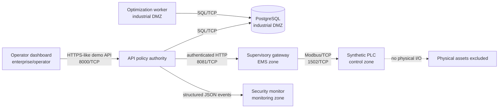

# DepotFlux synthetic OT architecture

Status: implemented local demonstrator design, 2026-09-07
Boundary: software simulation only; `direct_asset_control=false`

## System under consideration

The system under consideration (SUC) begins at the operator dashboard and ends
at the simulated site controller. It includes the API, durable optimization
worker, PostgreSQL evidence store, supervisory gateway, JSON security-event
path, monitor, and synthetic Modbus/TCP PLC. It excludes buses, chargers,
protection equipment, live field networks, utility interfaces, real identities,
and production security infrastructure.

The safety-relevant consequence being demonstrated is simple: an optimizer
result must not become an OT command unless a human approved the exact result,
the requested interval is valid, the command is fresh and unique, and its
derived setpoint is inside the software model's envelope. Failure closes the
path and produces evidence; transport ambiguity triggers a best-effort
zero-power safe-state command.



## Asset and software inventory

| Asset | Function | Zone | Data handled | Exposure |
|---|---|---|---|---|
| Dashboard | Operator review, approval and evidence display | Enterprise/operator | Synthetic input/result/evidence, session-only control key | `127.0.0.1:3000` |
| FastAPI service | Policy authority and versioned contracts | DMZ conduit endpoint | Run, approval, hash, actor, command evidence | `127.0.0.1:8000` |
| Optimization worker | Deterministic MILP execution | Industrial DMZ | Registered synthetic inputs and result payloads | None |
| PostgreSQL | Durable workflow and evidence store | Industrial DMZ | Runs, approvals, accepted/rejected attempts, events | None |
| Supervisory gateway | Freshness, replay, range, retry and heartbeat controls | Supervisory/EMS + control conduit | Minimal command envelope and protocol frames | None |
| Synthetic PLC | Register model and source allowlist | Control/PLC | Setpoints, measurement, state, alarm, heartbeat | None |
| Security monitor | Read-only aggregation of structured events | Enterprise/monitoring conduit | Event types and reason counts | `127.0.0.1:9100` |

Pinned top-level container dependencies are in `requirements-demo-lock.txt` and
`dashboard/package-lock.json`. Images run without root application privileges,
drop Linux capabilities, and set `no-new-privileges`. This inventory is not a
software bill of materials and has not been vulnerability-assessed.

## Purdue-style placement

This is an illustrative mapping, not a statement that Docker networks reproduce
all properties of an industrial architecture.

| Logical level | Demonstrator component |
|---|---|
| Level 4/5 enterprise | Browser and dashboard |
| Level 3.5 industrial DMZ | API-facing database conduit and durable worker |
| Level 3 supervisory | API policy boundary and internal OT gateway |
| Level 1/2 control | Synthetic site controller and register state |
| Independent monitoring | Security-event reader and evidence export |
| Level 0 process | Explicitly absent |

## Zones and conduits

`compose.yaml` declares five named bridge networks. Internal networks have no
default external route. The control network uses fixed addresses so the PLC can
allow only `172.29.40.5/32`, the gateway interface. The PLC and gateway publish
no host port.

| Source zone | Destination | Service/port | Purpose | Enforced disposition |
|---|---|---|---|---|
| Enterprise/operator | Dashboard | 3000/TCP | UI | Host loopback only |
| Enterprise/operator | API | 8000/TCP | Workflow and evidence API | Host loopback only; CORS allowlist |
| Industrial DMZ | PostgreSQL | 5432/TCP | Durable queue/evidence | Compose network only |
| API conduit | OT gateway | 8081/TCP | Approved command envelope/status | Separate gateway key |
| OT gateway | Synthetic PLC | 1502/TCP | Modbus FC03/FC10 | Gateway address allowlist |
| Monitoring | API | 8000/TCP | Read structured events | Compose network only |
| Enterprise/operator | Security monitor | 9100/TCP | Read-only security summary | Host loopback only |
| Any other component | Synthetic PLC | Any | Direct control/scan | No shared DNS/network; rejected |

Verification command:

```powershell
python scripts/verify_network_isolation.py --env-file .demo/ot-lab.env
```

The verifier proves the API, worker and monitor cannot resolve the PLC service,
and proves the gateway can open the conduit. It does not prove firewall
behavior, VLAN enforcement, routing security, or resistance to a compromised
container runtime.

## Data and trust flow

1. The worker writes a deterministic result and SHA-256 digest.
2. A human records one immutable approval or rejection bound to that digest.
3. The API derives a setpoint from the selected result interval; clients cannot
   submit an arbitrary regular setpoint.
4. The API checks the separate credential, successful state, approval, digest,
   deterministic validation, interval and site capacity.
5. The gateway checks time window, finite/range values and command-ID replay.
6. The gateway sends one FC10 write and an FC03 snapshot over a real TCP socket.
7. The API stores both accepted and rejected attempts with actor, command ID,
   correlation ID, hashes, timestamps, reason, policy checks and frames.
8. Security events use the same correlation ID for investigation.

The emergency endpoint is deliberately separate. It accepts only a reason and a
different credential, always requests zero power with command mode `safe_state`,
and preserves the evidence. A regular zero-power dispatch remains `active`; it
cannot be mislabeled as an emergency action.

## Synthetic controller register map

All power values use unsigned magnitude registers at 0.1 kW/count unless noted.

| Address | Name | Access | Meaning |
|---:|---|---|---|
| 100 | Import setpoint | FC10 write / FC03 read | Positive grid import magnitude |
| 101 | Export setpoint | FC10 write / FC03 read | Positive V2G export magnitude |
| 102 | Command mode | FC10 write / FC03 read | `0` dispatch, `1` safe state |
| 110 | Measured site power | FC03 read | Signed two's-complement net kW |
| 120 | Controller state | FC03 read | `1` ready, `2` active, `3` safe state |
| 121 | Alarm bitfield | FC03 read | safe, invalid write, heartbeat loss, unauthorized source |
| 130 | Heartbeat | FC03 read | Incrementing 16-bit software counter |

Import and export cannot both be non-zero. Safe-state mode requires both to be
zero. Undefined broad reads are treated as scan behavior and return a Modbus
exception. This register map is a project-specific simulation, not a vendor or
industry-standard device profile.

## Design limitations

- Docker network membership is a useful test boundary, not an industrial
  firewall, unidirectional gateway, jump host, or certified security appliance.
- Modbus/TCP is intentionally unauthenticated at the protocol layer; the model
  relies on segmentation, source allowlisting and the authenticated application
  conduit.
- Shared-secret headers and the user-supplied `X-Operator-ID` are demonstrator
  controls, not production identity, RBAC, MFA or non-repudiation.
- The gateway replay cache is in memory and is not shared across replicas.
- No physical I/O, hardware-in-the-loop, timing guarantee, functional-safety
  analysis, failover cluster, backup restore, penetration test or field
  commissioning is included.
