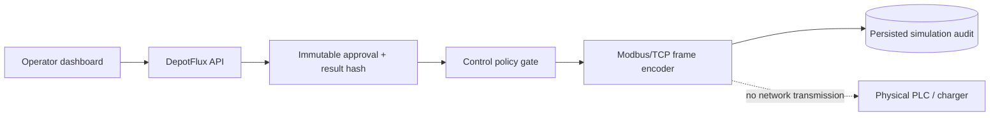

# DepotFlux OT Security Extension

This extension connects the existing human-approved optimization workflow to a
simulated operational-technology boundary. It is intentionally a software-only
demonstrator: no endpoint opens a socket to a charger, PLC, or field network.

## First evidence slice

An operator may select one interval from an approved, deterministically
validated schedule and request a control simulation. The API then:

1. authenticates the dedicated control-simulation credential;
2. verifies the immutable operator approval and result hash;
3. derives the net site-power setpoint from the optimizer output;
4. checks the interval, numeric value, and depot charger-capacity envelope;
5. encodes the setpoint as a Modbus/TCP write-single-register frame without
   transmitting it; and
6. persists the frame, decision context, actor, and timestamp for audit.

Duplicate requests for the same run and interval return the original record.
This makes retries safe and provides replay evidence without manufacturing a
second control action.

## Security boundary



- `X-Operator-ID` identifies the demonstrator actor but is not authentication.
- `X-Control-Key` is a separate demonstrator credential checked with a
  constant-time comparison. Production deployment would replace this with
  identity-provider authentication, role claims, credential rotation, and a
  managed secret store.
- The control-simulation endpoint is disabled when no control key is configured.
- The Modbus frame is an evidence artifact only. Direct asset control remains
  explicitly false in the product capability contract.
- The default holding register stores signed site power in 0.1 kW units. A
  positive value represents import/charging and a negative value represents
  export/V2G.

For local API use, configure a secret value before starting DepotFlux:

```powershell
$env:DEMO_CONTROL_API_KEY = "replace-with-a-local-secret"
agentic-aggregator-api
```

Then use the interactive API documentation to call
`POST /api/v1/runs/{run_id}/control-simulations` with `X-Control-Key`,
`X-Operator-ID`, and a one-based `interval_index`. Never commit the key.

## Evidence gate

This slice is complete only when unit and API tests demonstrate:

- unauthenticated requests are rejected;
- unapproved or rejected candidates cannot be converted;
- result-hash mismatches fail closed;
- out-of-range intervals and unsafe setpoints are rejected;
- an accepted frame decodes to the expected setpoint;
- the same run/interval cannot create a second dispatch record; and
- the run timeline includes the simulated control action.

Passing this gate supports a claim about designing and testing a secure,
auditable OT integration prototype. It does not support claims of production
deployment, field commissioning, IEC 62443 certification, or control of real
charging equipment.
