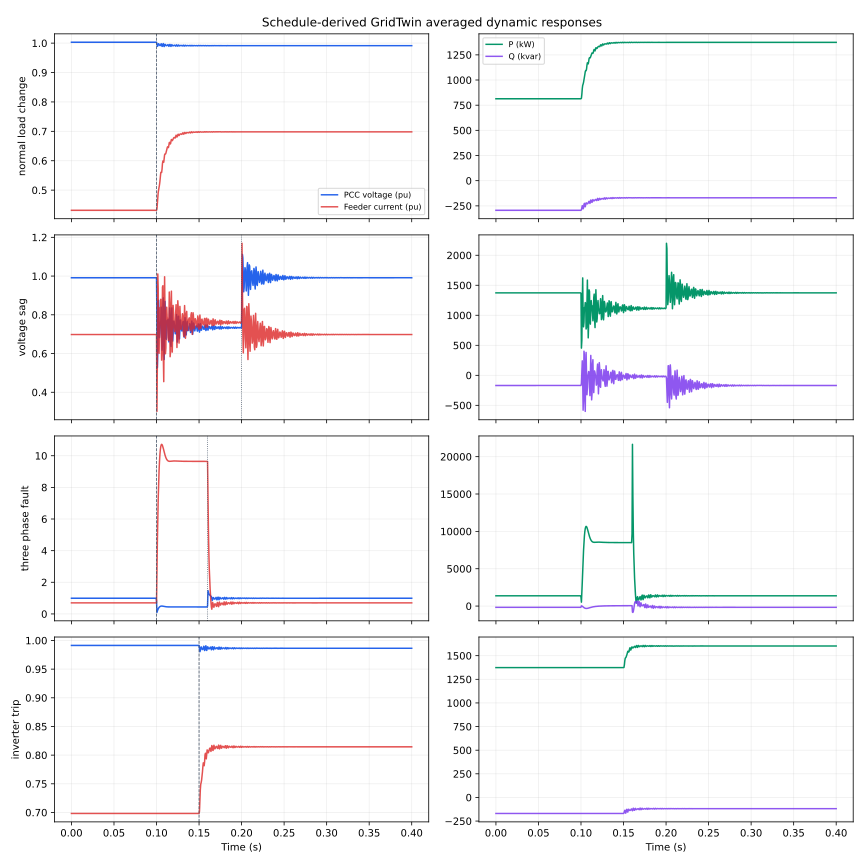
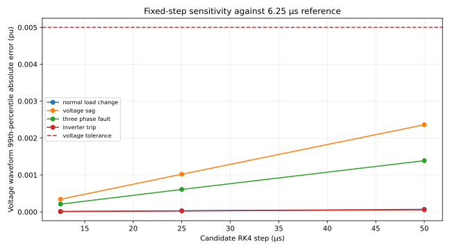

# GridTwin averaged electromagnetic-transient study

Generated: `2026-09-14T16:28:20.639472+00:00`
Experiment: `gridtwin-averaged-emt-depot-a-8-v1`

> Synthetic, software-only portfolio evidence. No physical asset was controlled. This is a balanced averaged-value study, not switching-level EMT, field validation, licensed-tool experience, protection coordination or a production grid model.

## Purpose and integration

The study consumes the existing GridTwin grid-constrained EV/BESS trajectory. It selects the highest-import interval, maps the charger demand and scheduled BESS support into a transparent source–feeder–PCC model, runs four short electrical disturbances, and returns a deterministic accept/reschedule message to the existing monitoring and remaining-horizon workflow.

## Schedule-derived operating point

| Input | Value |
|---|---:|
| Source experiment | `gridtwin-cigre-mv-depot-a-8-v1` |
| Selected interval (zero-based) | 8 |
| Aggregate charger demand | 1600.000 kW |
| BESS schedule sign (positive = charge) | -228.455 kW |
| BESS inverter injection | 228.455 kW |
| Net scheduled site demand | 1371.545 kW |

## Electrical model and assumptions

The fixed-step RK4 solver integrates eight synchronous-dq states: feeder d/q current, PCC d/q voltage, charger d/q current and BESS-inverter d/q current. The source and transformer/feeder are a Thevenin voltage behind series R–L. The PCC includes aggregate cable/filter capacitance, a small shunt conductance and an idealized voltage-dependent surge clamp. Charger and inverter currents track constant-P/Q references with explicit time constants and ratings. A balanced fault is a temporary equal per-phase shunt resistance.

| Parameter | Value |
|---|---:|
| `nominal_line_voltage_v` | 11000 |
| `nominal_frequency_hz` | 60 |
| `system_base_va` | 2000000 |
| `source_voltage_pu` | 1 |
| `feeder_resistance_ohm` | 1.21 |
| `feeder_inductance_h` | 0.01284 |
| `pcc_capacitance_f_per_phase` | 1e-05 |
| `pcc_shunt_conductance_s_per_phase` | 2e-05 |
| `charger_power_factor` | 0.98 |
| `charger_current_time_constant_s` | 0.008 |
| `charger_rating_kva` | 1800 |
| `inverter_current_time_constant_s` | 0.004 |
| `inverter_rating_kva` | 250 |
| `fault_resistance_ohm_per_phase` | 3 |
| `surge_clamp_threshold_pu` | 1.1 |
| `surge_clamp_conductance_s_per_phase` | 0.3 |
| `base_current_rms_a` | 104.972776 |
| `phase_voltage_rms_v` | 6350.85296 |
| `feeder_reactance_ohm_at_nominal_frequency` | 4.84056596 |

## Scenario results and pass/fail criteria



| Scenario | V min/max (pu) | I max (pu) | f min/max (Hz) | P peak (kW) | Abs Q peak (kvar) | Recovery (ms) | Result |
|---|---:|---:|---:|---:|---:|---:|---|
| Normal charger-load increase | 0.9880 / 1.0030 | 0.6989 | 59.768 / 60.032 | 1375.4 | 294.1 | 0.250 | PASS |
| Temporary 0.75 pu source-voltage sag | 0.5146 / 1.1159 | 1.1732 | 56.009 / 63.742 | 2448.9 | 651.0 | 51.050 | PASS |
| Cleared balanced three-phase PCC fault | 0.0296 / 1.5507 | 10.7190 | 58.283 / 69.135 | 28189.6 | 859.8 | 55.300 | PASS |
| BESS inverter trip | 0.9801 / 0.9914 | 0.8175 | 59.875 / 60.043 | 1608.9 | 169.8 | 0.000 | PASS |

Criteria for **Normal charger-load increase**:

- PASS — finite numerical state: `True`; limit `true`.
- PASS — post-event voltage lower bound: `0.9913584943677292`; limit `>= 0.95 pu`.
- PASS — post-event voltage upper bound: `0.9913585741992289`; limit `<= 1.05 pu`.
- PASS — voltage recovery time: `0.0002500000000000002`; limit `<= 0.15 s`.
- PASS — post-event frequency deviation: `1.2183713380409245e-06`; limit `<= 1.0 Hz`.
- PASS — transient voltage lower bound: `0.9880005128150086`; limit `>= 0.90 pu`.
- PASS — transient voltage upper bound: `1.002987990854801`; limit `<= 1.10 pu`.
- PASS — feeder current: `0.6989037758661059`; limit `<= 1.20 pu`.

Recorded violation durations:

- `voltage_outside_0_90_to_1_10_duration_s`: `0.000000` s.
- `feeder_current_above_1_20_pu_duration_s`: `0.000000` s.
- `frequency_outside_59_to_61_hz_duration_s`: `0.000000` s.

Criteria for **Temporary 0.75 pu source-voltage sag**:

- PASS — finite numerical state: `True`; limit `true`.
- PASS — post-event voltage lower bound: `0.9912772311080136`; limit `>= 0.95 pu`.
- PASS — post-event voltage upper bound: `0.9914533066200042`; limit `<= 1.05 pu`.
- PASS — voltage recovery time: `0.051049999999999984`; limit `<= 0.15 s`.
- PASS — post-event frequency deviation: `0.002360082501908778`; limit `<= 1.0 Hz`.
- PASS — sag retained voltage: `0.5145521678787628`; limit `>= 0.50 pu`.
- PASS — sag-clearing transient overvoltage: `1.1159354612513652`; limit `<= 1.20 pu`.
- PASS — sag feeder current: `1.1731628627193573`; limit `<= 1.50 pu`.

Recorded violation durations:

- `voltage_outside_0_90_to_1_10_duration_s`: `0.100300` s.
- `feeder_current_above_1_20_pu_duration_s`: `0.000000` s.
- `frequency_outside_59_to_61_hz_duration_s`: `0.023250` s.

Criteria for **Cleared balanced three-phase PCC fault**:

- PASS — finite numerical state: `True`; limit `true`.
- PASS — post-event voltage lower bound: `0.9913445274731119`; limit `>= 0.95 pu`.
- PASS — post-event voltage upper bound: `0.9913727448820236`; limit `<= 1.05 pu`.
- PASS — voltage recovery time: `0.055300000000000016`; limit `<= 0.15 s`.
- PASS — post-event frequency deviation: `0.0005178451937268846`; limit `<= 1.0 Hz`.
- PASS — fault application observed: `0.029629015846912913`; limit `< 0.70 pu`.
- PASS — fault-clearing transient overvoltage: `1.5506800768436988`; limit `<= 1.80 pu`.
- PASS — fault current within study bound: `10.719035589609675`; limit `<= 15.0 pu`.

Recorded violation durations:

- `voltage_outside_0_90_to_1_10_duration_s`: `0.065825` s.
- `feeder_current_above_1_20_pu_duration_s`: `0.063275` s.
- `frequency_outside_59_to_61_hz_duration_s`: `0.021175` s.

Criteria for **BESS inverter trip**:

- PASS — finite numerical state: `True`; limit `true`.
- PASS — post-event voltage lower bound: `0.9863852666551164`; limit `>= 0.95 pu`.
- PASS — post-event voltage upper bound: `0.9863859482622819`; limit `<= 1.05 pu`.
- PASS — voltage recovery time: `0.0`; limit `<= 0.15 s`.
- PASS — post-event frequency deviation: `1.1356991073796507e-05`; limit `<= 1.0 Hz`.
- PASS — trip transient voltage lower bound: `0.980062742073357`; limit `>= 0.90 pu`.
- PASS — trip transient voltage upper bound: `0.9913585284596063`; limit `<= 1.10 pu`.
- PASS — trip feeder current: `0.8174901587715694`; limit `<= 1.20 pu`.

Recorded violation durations:

- `voltage_outside_0_90_to_1_10_duration_s`: `0.000000` s.
- `feeder_current_above_1_20_pu_duration_s`: `0.000000` s.
- `frequency_outside_59_to_61_hz_duration_s`: `0.000000` s.

## Validation and solver-step sensitivity

The independent quadratic two-bus solution gives `0.973020239746 pu`; the iterative phasor initializer gives `0.973020239746 pu`. Absolute error is `1.688e-14 pu` against `1.0e-08 pu`: **PASS**.



The reference uses the same equations at 6.25 µs. A response comparison uses the 99th-percentile absolute waveform error so one sample at an ideal discontinuity does not dominate; voltage/current extrema and recovery time are checked separately. The selected 25 µs step and every tested finer step must pass. The deliberately retained 50 µs run exposes coarse-step sensitivity and is not used for reported scenario metrics.

| Scenario | Step (µs) | Waveform check | Extrema check |
|---|---:|---|---|
| `normal_load_change` | 50.00 | PASS | PASS |
| `normal_load_change` | 25.00 | PASS | PASS |
| `normal_load_change` | 12.50 | PASS | PASS |
| `voltage_sag` | 50.00 | FAIL | PASS |
| `voltage_sag` | 25.00 | PASS | PASS |
| `voltage_sag` | 12.50 | PASS | PASS |
| `three_phase_fault` | 50.00 | PASS | FAIL |
| `three_phase_fault` | 25.00 | PASS | PASS |
| `three_phase_fault` | 12.50 | PASS | PASS |
| `inverter_trip` | 50.00 | PASS | PASS |
| `inverter_trip` | 25.00 | PASS | PASS |
| `inverter_trip` | 12.50 | PASS | PASS |

## Monitoring and rescheduling feedback

The loss-of-BESS-support screen returned **`request_reschedule`**. Settled contingency voltage was `0.986386 pu` versus the documented planning threshold `0.990 pu`. Recommended maximum depot import is `1371.545` kW. The output includes `replanning_structured_facts` with per-charger deratings in the same contract consumed by the existing remaining-horizon optimizer. This is a decision-support bound; it is not dispatched to equipment.

## Limitations

- Balanced positive-sequence representation; unbalance, harmonics, switching ripple, saturation and detailed converter controls are excluded.
- Frequency is a one-cycle PCC-voltage angle estimate against a fixed 60 Hz source; this model has no synchronous-machine swing dynamics.
- Fault and surge-clamp elements are deliberately simple equivalents. Fault current is not suitable for relay settings or equipment-duty decisions.
- Parameters are declared engineering assumptions, not utility, OEM or field measurements. Results establish only deterministic software-model behavior.
- The finer-step run checks numerical convergence of the same equations, not correctness against a commercial EMT package or physical system.

## Reproduce

From the `GridTwin-Ops` directory with the pinned Python environment installed:

```powershell
python scripts/run_grid_dynamics_evidence.py
python -m pytest -q tests/test_gridtwin_dynamics.py tests/test_grid_dynamics_evidence_script.py
```

Outputs are `results.json`, this report, `dynamic-responses.svg` and `step-sensitivity.svg` under `evidence/grid-dynamics/`.
